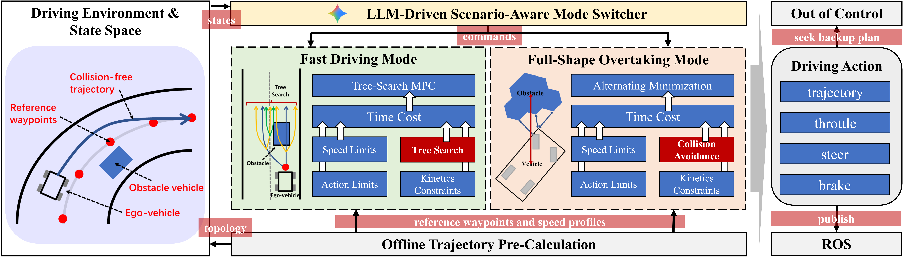

He Li is currently a Ph.D. student in Computer Science at University of Macau. His research interests lie in robot motion planning and autonomous driving. He is advised by [Prof. Chengzhong Xu (FIEEE)](https://www.fst.um.edu.mo/personal/czxu/) and [Prof. Shuai Wang](https://people.ucas.ac.cn/~shuaiwang).

He Li received his BEng degree in Electronic Science & Technology from the Southeast University in 2020, and the MS degree in Computer Science from the University of Macau in 2024. Also, he holds the qualification of embedded system development engineer. Before joining UM, he works as a software engineer at Vivo and Nokia, successively.

## News: ##
- 2026-06 &emsp; He Li attended the ICRA 2026, and presented the DCT paper.

- 2026-01 &emsp; One paper got accepted by ICRA (CORE A*)!

- 2026-01 &emsp; One paper got accepted by ICASSP (CCF-B)!

- 2025-10 &emsp; He Li is invited to give a presentation on IOTSC Postgraduate Student Forum! [[events](https://skliotsc.um.edu.mo/event/postgraduate-student-forum-intelligent-transportation-2/)]

- 2025-08 &emsp; One paper got accepted by TCCN (JCR Q1, IF=7.0)!

## Selected Publications: ##

  <video class="publication-card__media" controls autoplay loop muted playsinline preload="metadata">
    <source src="../videos/DCT.mp4" type="video/mp4">
  </video>
  

    
  Direct Contact-Tolerant Motion Planning With Vision Language Models
     
    <strong>He Li</strong>, Jian Sun, Chengyang Li, Guoliang Li, Qiyu Ruan, Shuai Wang, Chengzhong Xu, 
    <em>IEEE International Conference on Robotics & Automation (ICRA) </em>, Vienna, Austria, May 2026.
    [<a href="https://arxiv.org/abs/2603.05017" target="_blank">paper</a>]
    [<a href="https://github.com/ChrisLeeUM/DCT" target="_blank">code</a>]
  

  <video class="publication-card__media" controls autoplay loop muted playsinline preload="metadata">
    <source src="../videos/SVR.mp4" type="video/mp4">
  </video>
  

    
  Seamless Virtual Reality with Integrated Synchronizer and Synthesizer for Autonomous Driving
     
    <strong>He Li</strong>, Ruihua Han, Zirui Zhao, Wei Xu, Qi Hao, Shuai Wang, Chengzhong Xu, 
    <em>IEEE Robotics and Automation Letters</em>, Feb. 2024.
    [<a href="https://arxiv.org/abs/2403.03541" target="_blank">paper</a>]
  

  
  

    
      LLM-driven scenario-aware planning for autonomous driving
    
    <strong>He Li</strong>, Zhaowei Chen, Rui Gao, Guoliang Li, Qi Hao, Shuai Wang, and Chengzhong Xu, 
    <em>IEEE International Conference on Acoustics, Speech, and Signal Processing (ICASSP)</em>, Barcelona, Spain, May 2026.
    [<a href="https://arxiv.org/abs/2601.21876" target="_blank">paper</a>]
  

  <video class="publication-card__media" controls autoplay loop muted playsinline preload="metadata">
    <source src="../videos/IROS_uncertainty.mp4" type="video/mp4">
  </video>
  

    
  Multi-Uncertainty Aware Autonomous Cooperative Planning
     
    Shiyao Zhang*, <strong>He Li*</strong>, Shengyu Zhang, Shuai Wang*, Derrick Wing Kwan Ng, Chengzhong Xu, 
    <em>IEEE/RSJ International Conference on Intelligent Robots and Systems (IROS)</em>,  Abu Dhabi, UAE, Oct. 2024.
    [<a href="https://arxiv.org/pdf/2411.00413" target="_blank">paper</a>]
  

## Awards: ##

- Award of Poster Presentation (top 3), Macao Symposium on Cloud Computing and Intelligent Driving (CCID), 2024

- Best MSc Student Award (top 5%), UM Faculty of Science and Technology, 2024 [[news](https://www.fst.um.edu.mo/news/stepping-out-of-the-comfort-zone-lis-journey-of-pursuing-his-dream-in-artificial-intelligence/)]

- Best Student Paper Award, IEEE ICDCS Workshop, 2023

- The First Prize in National College Students FPGA Innovative Design Invitational Competition, Dec. 2018

- The First Prize in 2018 Electronic Design Contest for Jiangsu Provincial College Students (TI Cup), Aug. 2018

## Services: ##

Reviewer of IEEE Transactions on Systems, Man, and Cybernetics (T-SMC), IEEE Transactions on Mobile Computing (T-MC), IEEE Robotics and Automation Letters (R-AL), CoRL, IROS, IEEE Open Journal of the Communications Society.

## Academic Activities: ##

  <button class="activity-carousel__button activity-carousel__button--previous" type="button" aria-label="Previous activity">&#10094;</button>

  

    

      <figure class="activity-slide">
        
        <figcaption>Research discussion at ICRA 2026, Vienna, Austria.</figcaption>
      </figure>

      <figure class="activity-slide">
        
        <figcaption>Visit to Manifold Tech, 2026.</figcaption>
      </figure>

      <figure class="activity-slide">
        
        <figcaption>Best MSc Student Award with Prof. Cheng-Zhong Xu, 2024.</figcaption>
      </figure>

      <figure class="activity-slide">
        
        <figcaption>Oral presentation at IROS 2024, Abu Dhabi, UAE.</figcaption>
      </figure>
    

  

  <button class="activity-carousel__button activity-carousel__button--next" type="button" aria-label="Next activity">&#10095;</button>
  

